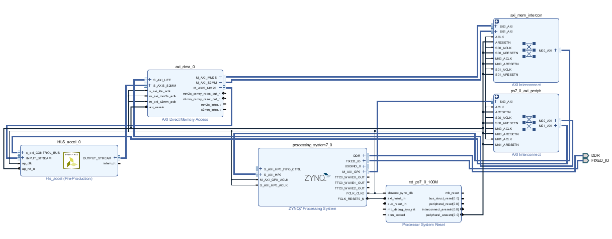

# xapp1170_floating_point_matrix_multiplication

This repository is a self-learning project practicing the Xilinx application note XAPP1170 in the course "Multimedia System-on-Chip Design (2020 Fall)."

## Table of Contents

* [About the Project](about-the-project)
* [Usage](#usage)
* [Algorithm](#algorithm)
* [References](#references)
* [Contact](#contact)

## About The Project

The project is to practice the Xilinx application note **"XAPP1170 - A Zynq Accelerator for Floating Point Matrix Multiplication Designed with Vivado HLS."**

Designs in this project are implemented with Vivado HLS / Vivado 2019.2 and targeting the Xilinx Zynq-7000 All Programmable SoC (Zedboard).

The whole application is run on the PYNQ framework.

**Directory structure**

* **README.md** - Introduce the project.
* **hls/** - The directory for running Vivado HLS, containing the C++ code.
  * mmult.h
  * mmult_accel.cpp
  * mmult_test.cpp
  * run_hls_script.tcl
* **vivado/** - The directory for building the hardware design with Vivado. Here only the generated bitstream file and the hardware handoff file are provided.
  * fp_mmult.bit
  * fp_mmult.hwh
* **fp_mmult.ipynb** - Python code for running the application on the Jupyter Notebook of Zedboard.

## Usage

* **Build HLS design**

  Run ***run_hls_script.tcl***. The script will generate two projects with four solutions:

  * **hls_mmult_prj (solution 1~3)** - standalone matrix multiplier with a baseline solution and two different optimized solution.
  * **hls_wrapped_mmult_prj (solution 0)** - wrapping the AXI4-Stream interface on the optimized design (solution 3)

* **Build hardware design**

  Use the exported IP from HLS (AXI4-Stream wrapped) to build the hardware design in Vivado. The block design of this project is shown below.

  

* **Run the application**

  Put the bitstream file and the hardware handoff file onto Zedboard.

  Run the python code ***fp_mmult.ipynb*** on Jupyter Notebook. Note that the path of the bitstream file has to be changed to your own path.

## Algorithm

The algorithm of ***A x B = C*** contains three nested loops:

* L1 iterates over the rows of the input matrix ***A***.
* L2 iterates over the columns of the input matrix ***B***.
* L3 multiplies each index of the row vector of ***A*** with an index of the column vector of ***B*** and accumulates it to generate the elements of a row of the output matrix ***C***.

## References

* Xilinx Application Note "XAPP1170 - A Zynq Accelerator for Floating Point Matrix Multiplication Designed with Vivado HLS."
* Lecture Notes of the course "Multimedia System-on-Chip Design (2020 Fall)."

## Contact

tofumanjeff@gmail.com
